```{r, echo=FALSE}
library(metathis)
meta() %>% 
  meta_description(params$event) %>% 
  meta_name("github-repo" = paste0("datactivist/", params$slug)) %>% 
  meta_viewport() %>% 
  meta_social(
    title = params$title,
    url = paste0("https://datactivist.coop/", params$slug),
    image = params$image,
    image_alt = params$image_alt,
    og_type = "website",
    og_author = "Datactivist",
    og_locale = "fr_FR",
    og_site_name = "Datactivist",
    twitter_card_type = "summary",
    twitter_creator = "@datactivi_st")

```

layout: true

<style>
.remark-slide-number {
  position: inherit;
}

.remark-slide-number .progress-bar-container {
  position: absolute;
  bottom: 0;
  height: 4px;
  display: block;
  left: 0;
  right: 0;
}

.remark-slide-number .progress-bar {
  height: 100%;
  background-color: #e95459;
}

</style>


`r paste0("<div class='my-footer'><span>", params$event, "</span> <center><div class=logo><a href='https://datactivist.coop/'></a></div></center></span></div>")` 


---
class: inverse, center, middle
background-image: url(https://cfeditions.com/donnees-democratie/ressources/couv_donnees-democratie_grand.jpg)


## Les données de la démocratie
### Un bilan critique de l'open data

### Samuel Goëta
### Datactivist et Sciences Po Aix

#### Data Sandwich, Grand Poitiers, 14 mai 2024

---
class: center, middle, inverse

Ces slides en ligne : `r paste0("http://datactivist.coop/", params$slug)`

Sources : `r paste0("https://github.com/datactivist/", params$slug)`


Les productions de Datactivist sont librement réutilisables selon les termes de la licence [Creative Commons 4.0 BY-SA](https://creativecommons.org/licenses/by-sa/4.0/legalcode.fr).

<BR>
<BR>


---
class:inverse


### La massification des usages de l'open data

.pull-left[

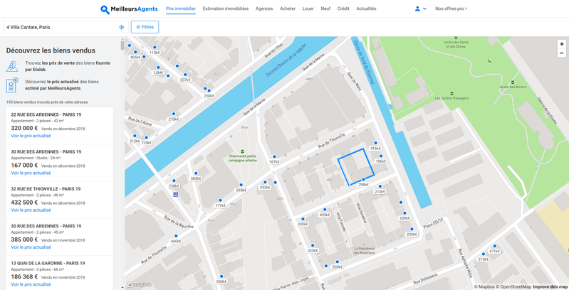


]

.pull-right[


]


---
### Les données ouvertes : une question de .red[démocratie]

.red[Comment faire pour mettre les données ouvertes au service des citoyens  et de la démocratie ? L’open data est-il vraiment un contre-pouvoir ?]

.pull-left[


Open data : accès à la matière première de l’information et du savoir. Refaire les calculs et proposer de nouvelles interprétations.  

—> Un outil de la « contre-démocratie » : enrichit la démocratie, la conforte et fait système avec les institutions démocratiques

—> Un outil d’empowerment et d’émancipation
]

.pull-right.center[

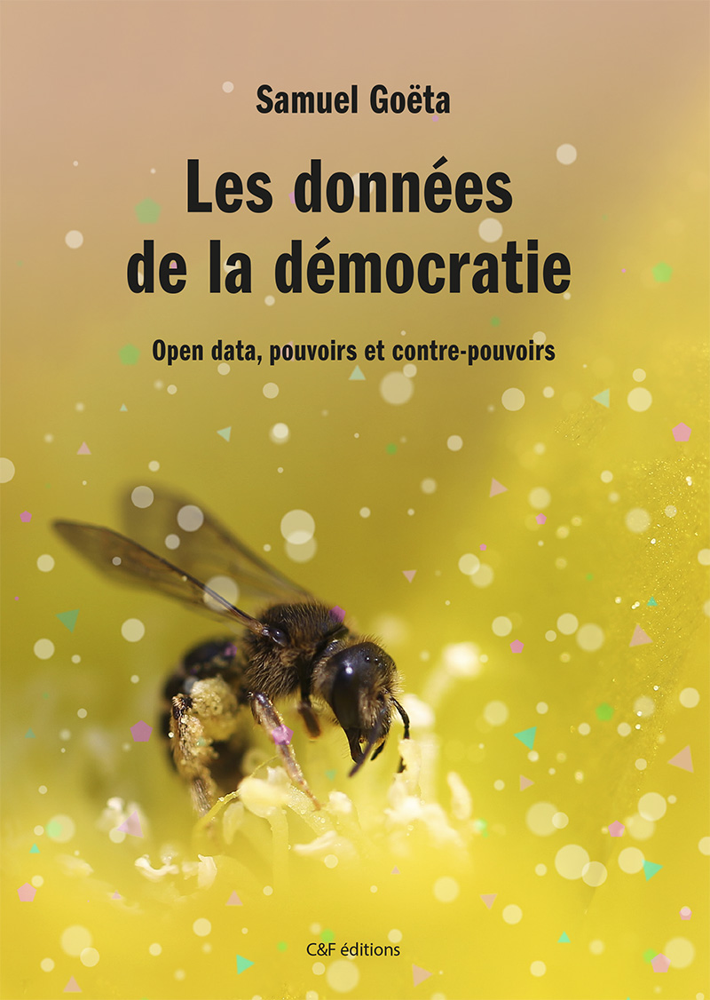
]

---
class:inverse, middle, center

## .red[Partie 1]
### Naissance et émergence de l'open data

---
.red[**Chapitre 1**]
### Les racines multiples de l'open data

.pull-left[


]

.pull-right[
Loin d'être un phénomène récent, un mouvement aux multiples facettes :
- la transparence et le droit d'accès
- la liberté de l'information et le logiciel libre
- le partage des données de la recherche
- la modernisation des administrations
- les industries de l'information
- l'entrainement des modèles d'IA

]
---
.red[**Chapitre 2**]
### Les grandes étapes de la définition des principes de l'open data

.pull-left[
Quelques jalons : 
- l'Open Definition

- la rencontre de Sebastopol

- la Charte internationale de l'open data

**Vers une .red[troisième vague] de l'open data ?**

]

.pull-right[


.reduite[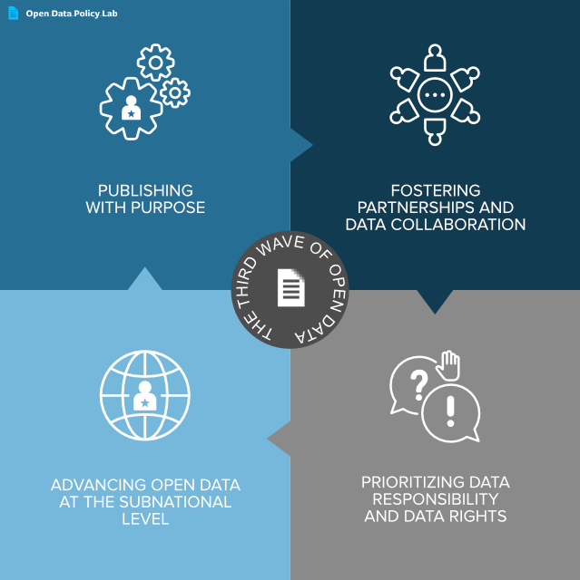]
]

---

.red[**Chapitre 3**]
### L’ancrage .red[instable] de l’ouverture des données dans l’administration
.pull-left[
- Les premières initiatives locales : Rennes, PACA, Nantes, Paris… 

- La création d'Etalab et le lancement de data.gouv.fr

- La loi pour une République numérique

- Vers une administration des données ?

]

.pull-right[

]

---
.red[**Chapitre 4**]
### La pandémie de Covid-19, un .red[moment charnière]

.pull-left[


]

.pull-right[
- De premières ouvertures de données incitées par des initiatives citoyennes

- Des données réutilisées massivement, une relance de la politique d'ouverture des données

- L'émergence des médiateurs de données
]
---
class:inverse, middle, center

## .red[Partie 2]
### Un bilan critique de l'open data

---
.red[**Chapitre 5**]

<h3 style="margin-top:0px;margin-bottom:0px"> Un renouvellement de la transparence .red[en demi-teinte] </h3>

.pull-left[
Les fondements juridiques instables de la transparence administrative

L’open data : un carburant pour les « machines à scandale » ?

Des données « inoffensives » ?

Faut-il produire ses propres données ?
]

.pull-right[

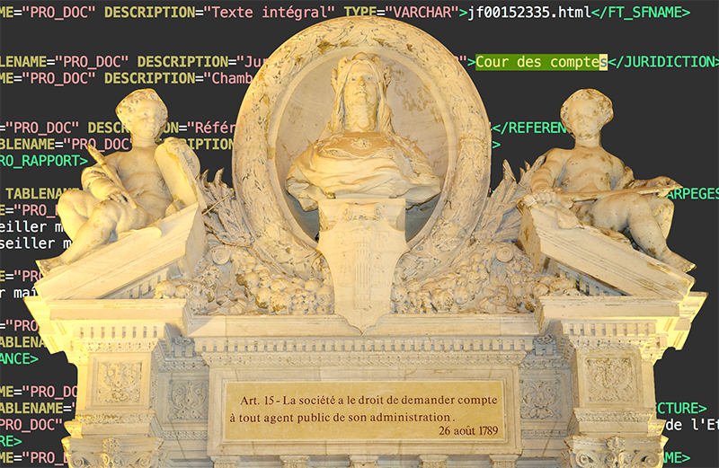

]
---
class:inverse
### Un exemple : les Indices de Position Sociale des établissements scolaires

.pull-left.center[

]

.pull-right[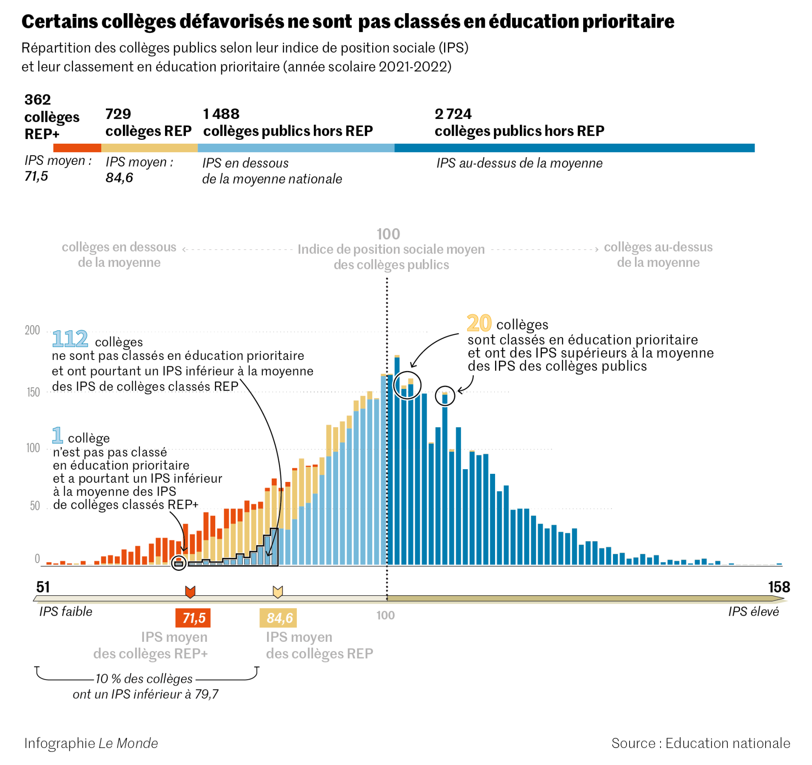]
---
class:inverse
### Autre exemple : les notes de frais des maires

.pull-left.center[
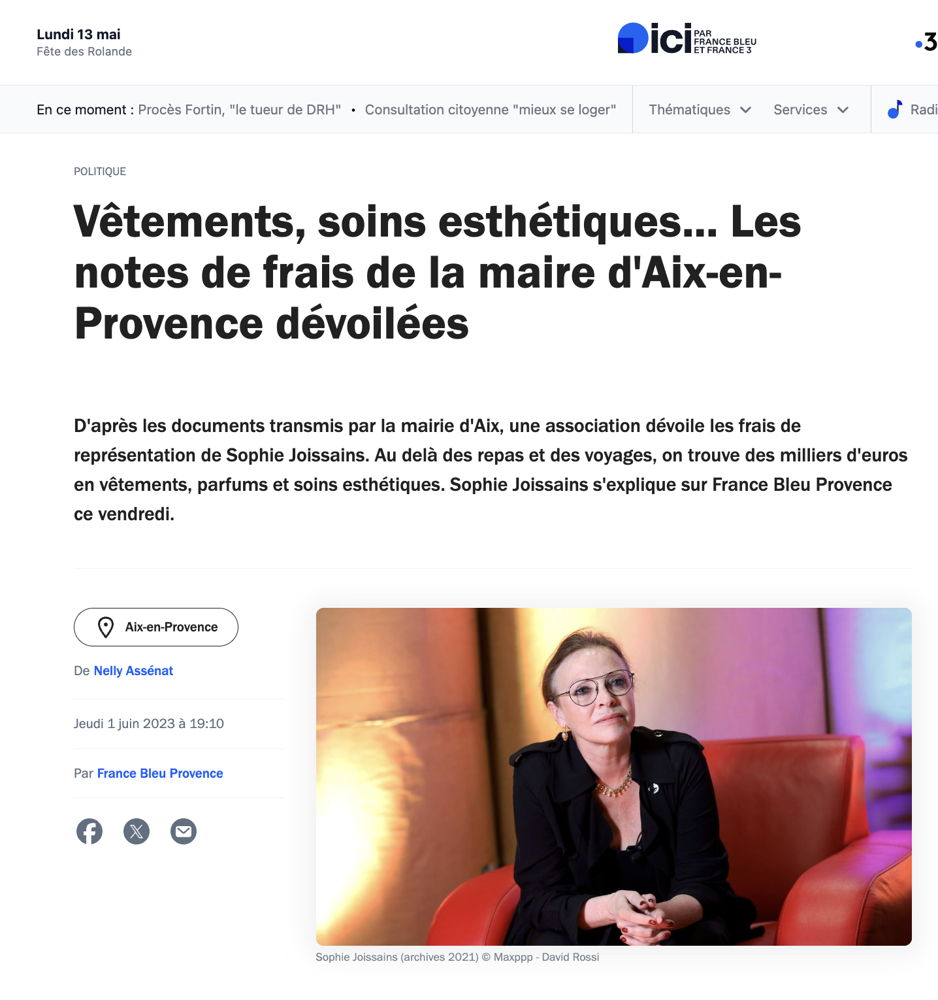
]

.pull-right[
Lire à ce sujet : [chicane-lemag.fr/16](https://chicane-lemag.fr/16)
]
]
---
.red[**Chapitre 6**]

<h3 style="margin-top:0px;margin-bottom:0px"> Des promesses démesurées de .red[croissance et d’innovation] </h3>

.pull-left[
Le « nouveau pétrole » : des conjectures de croissance et d’emploi disproportionnées

Un impact en deçà des attentes sur la création d’emploi

Des données souvent introuvables et mal documentées

Des données pas encore assez fiables pour créer des services pérennes
]

.pull-right[

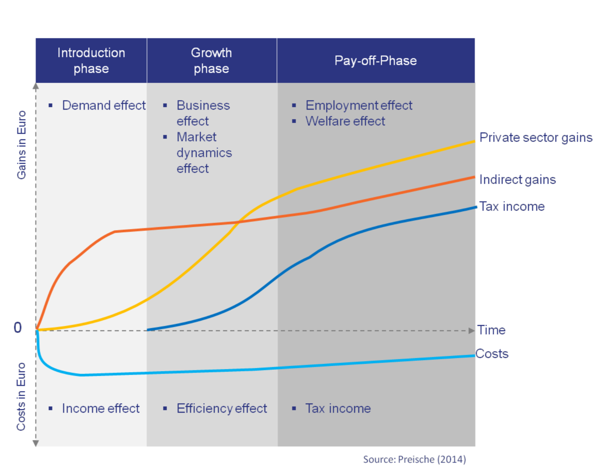
]

---
class:inverse

### Quelques exemples de services nés de l'open data

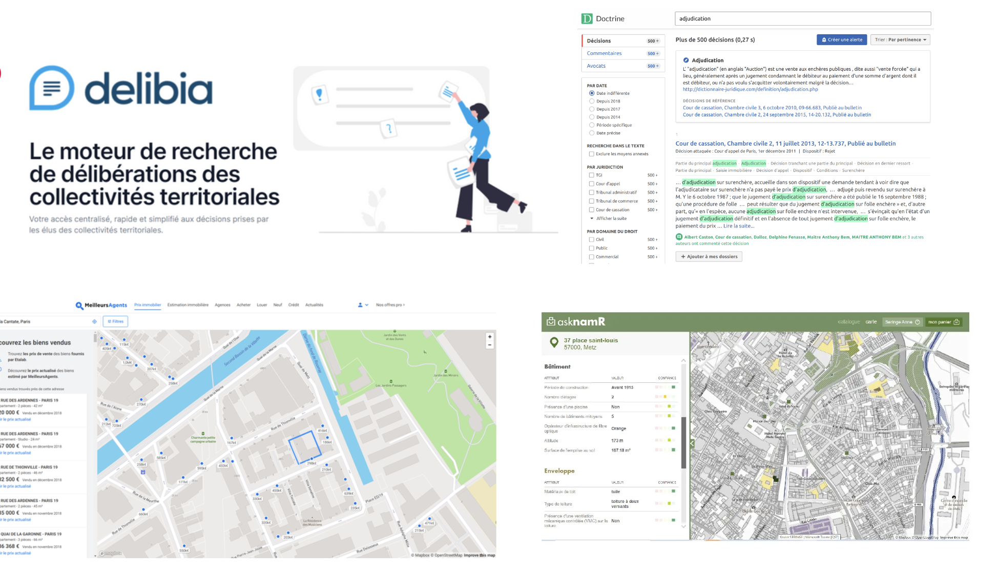


---
.red[**Chapitre 7**]

<h3 style="margin-top:0px"> Une transformation des administrations .red[en cours] </h3>


.pull-left[
Le mirage de l’ouverture des données par défaut

Les nombreux obstacles à surmonter dans l’ouverture des données

Les bénéfices inattendus de l’ouverture des données pour le fonctionnement des administrations

]

.pull-right[
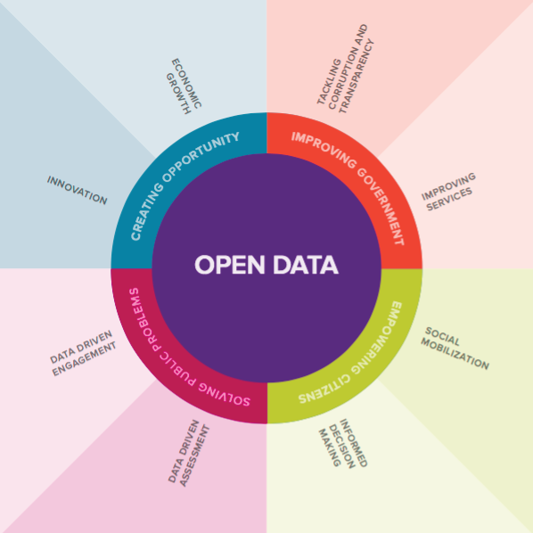

.footnote[illustration : [GovLab - Open Data Impact](https://odimpact.org/)]
]

---
class:inverse

### Un exemple d'usage dans le Grand Poitiers

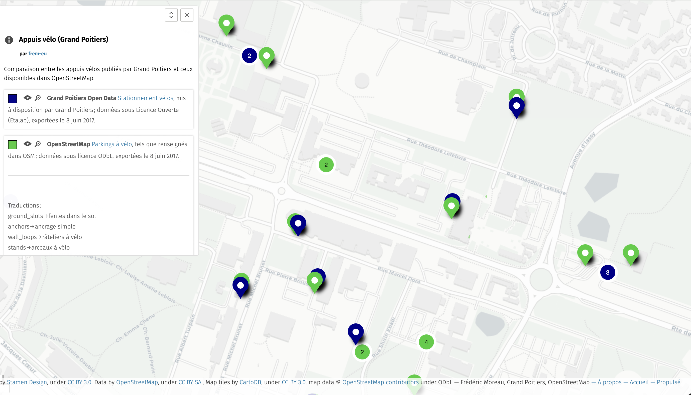

---

.red[**Chapitre 8**]

### Cinq stratégies alternatives pour .red[obtenir des données]

.pull-left[
.red[1. ]Recourir au droit d’accès

.red[2. ]Scraper les données sur le web

.red[3. ]Rassembler des données à partir des informations disponibles

.red[4. ]Faire appel à une foule de contributeurs

.red[5. ]Concevoir des communs de données 
]

.pull-right[

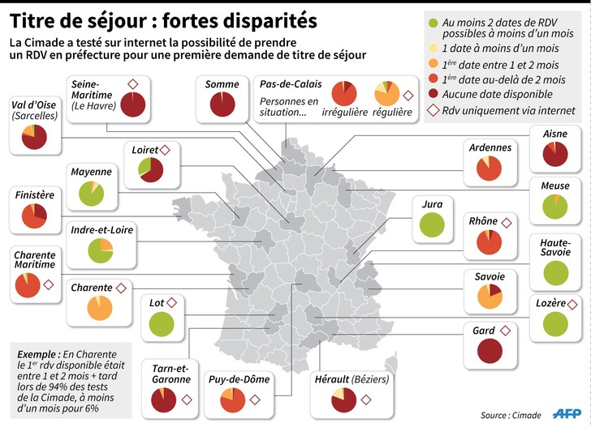
Un exemple : la Cimade avec [À guichets fermés](https://aguichetsfermes.lacimade.org/)

]

---

.red[**Chapitre 9**]
<h3 style="margin-top:0px;margin-bottom:0px"> Chantiers et .red[pistes d’action] </h3>
.pull-left[
.middle[
.red[1. ]Obtenir les données qui manquent

.red[2. ]Améliorer la qualité et la fiabilité

.red[3. ]Développer la culture des données
]
]

.pull-right[
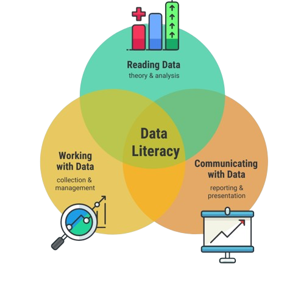
.footnote[
[Venngage](https://venngage.com/blog/data-literacy/)
]
]

---
class:inverse

### .red[Conclusion] : approfondir et étendre la démocratie

.pull-left[
- Un écosystème fragile

- Approfondir la démocratie : d'un droit à un devoir de rendre des comptes

- Étendre la démocratie : ouvrir la gouvernance des données, étendre l'ouverture aux algorithmes


]

--
.pull-right[
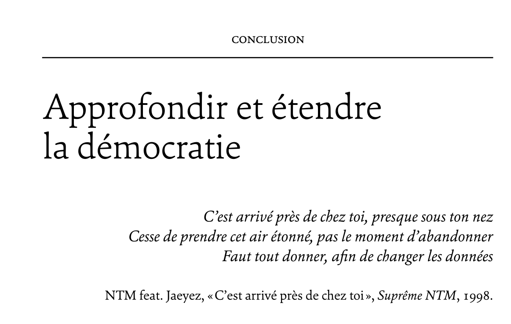
"Changer les données" : des données pour transformer la réalité
]
---
class:inverse, middle, center

### Découvrez le portail de données ouvertes Grand Poitiers
### .red[https://data.grandpoitiers.fr/]


.pull-left[
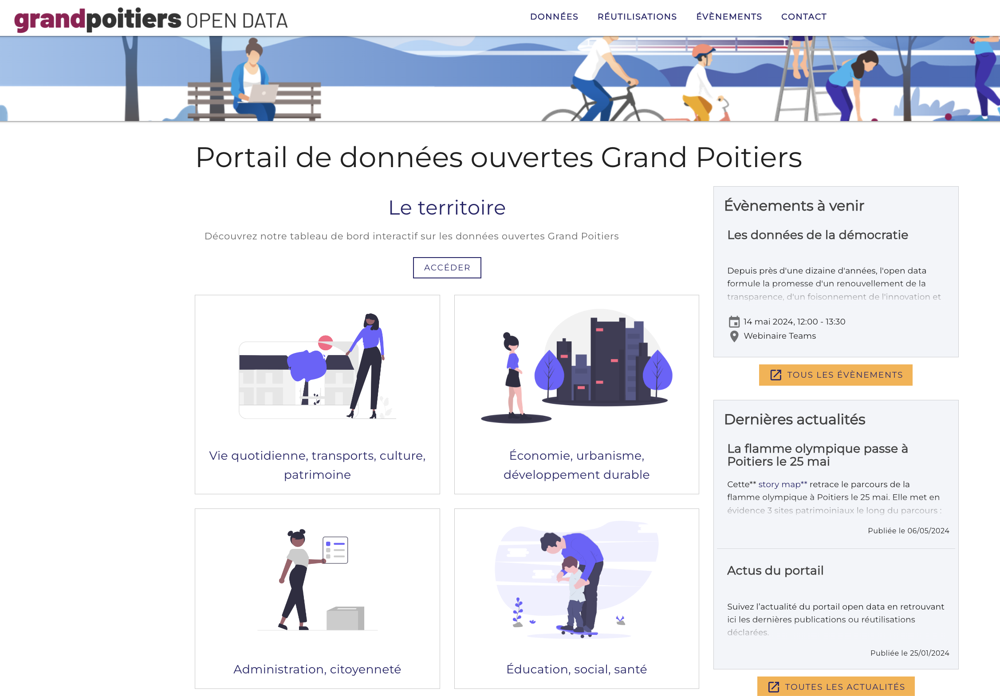
]

.pull-right[
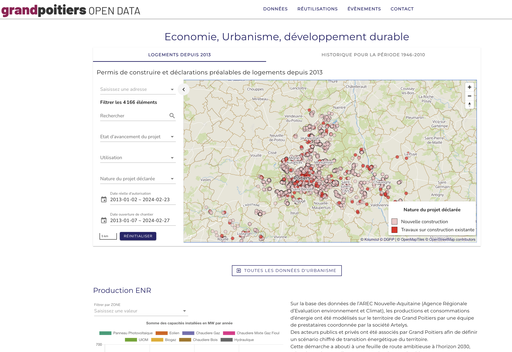
]

class:inverse,middle,center
# Merci !

Contact : [samuel@datactivist.coop](mailto:samuel@datactivist.coop)


